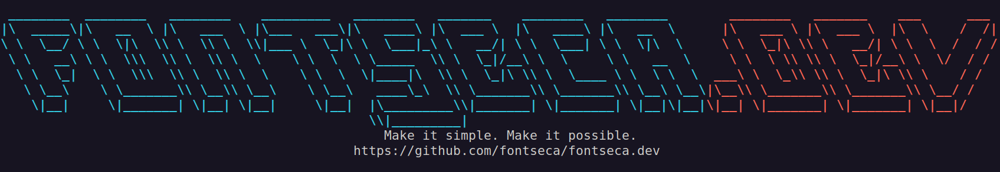

<div align="center">
  

---

  <a href="https://golang.org/doc/go1.23">
    
  </a>
  <a href="https://opensource.org/licenses/MIT">
    
  </a>
  
</div>

Welcome to the source code of my personal website, [fontseca.dev](https://fontseca.dev/). This site is a dedicated
portal where I share my work, experience, ideas, interests, and thoughts. The project represents the culmination of four
years of strong desired to have a place of my own, and one year of devoted work to make it possible. The initial design was just a single info page about myself, but it eventually turned into a more complete and complex
platform.

One of my favorite sections in the site is *[the archive](https://fontseca.dev/archive/)*.
Before starting the web, I faced a dilemma: use an existing
platform like Hugo, or create a blog manager myself from scratch.
After some thinking, I chose to build my own blog manager—what I decided to call _the archive_.
Here, I address subjects I find interesting and worth sharing. As other sections of the site, the archive is fully managed through an RPC-like API that powers the content,
and constitutes one of the core parts of my website, alongside my [playground](https://fontseca.dev/playground/). In
this archive, I discuss certain [topics](https://fontseca.dev/playground?target=/archive.topics.list) that interest me.

As a back-end engineer, I encountered a problem most of us have suffered when we want to have a website to present
our work.
When we work on APIs, we often want to showcase some of our labor.
We could talk about it in a detailed article, but most of the time we want to play around with the product.
That is why
I created the second cornerstone of my website—what I call *[the playground](https://fontseca.dev/playground/)*; which is, by the
way, [open source](https://github.com/fontseca/playground/) and available for integration into other projects.

<div align="center" style="display: flex; justify-content: center; text-align: center;">
  <a href="https://youtu.be/NCcJdYM-UOo" target="_blank">
    
  </a>
    <p class="text-align: center;"><i>cheerfully celebrating the launch of my personal website built with go 1.23 — fontseca.dev</i></p>
</div>

## Table of Contents

<!-- TOC -->
  * [Table of Contents](#table-of-contents)
  * [The Archive](#the-archive)
    * [Articles Lifecycle](#articles-lifecycle)
  * [The Playground](#the-playground)
* [API Reference](#api-reference)
  * [Errors](#errors)
    * [`internal`](#internal)
    * [`missing_argument`](#missing_argument)
    * [`unparseable_value`](#unparseable_value)
    * [`not_found`](#not_found)
    * [`out_of_range`](#out_of_range)
    * [`unmet_validation`](#unmet_validation)
    * [`duplicate_key`](#duplicate_key)
    * [`action_already_completed`](#action_already_completed)
    * [`action_refused`](#action_refused)
  * [Me](#me)
    * [`me.get`](#meget)
    * [`me.set`](#meset)
    * [`me.set_photo`](#meset_photo)
    * [`me.set_resume`](#meset_resume)
    * [`me.set_hireable`](#meset_hireable)
  * [Experience](#experience)
    * [`me.experience.list`](#meexperiencelist)
    * [`me.experience.hidden.list`](#meexperiencehiddenlist)
    * [`me.experience.get`](#meexperienceget)
    * [`me.experience.create`](#meexperiencecreate)
    * [`me.experience.set`](#meexperienceset)
    * [`me.experience.hide`](#meexperiencehide)
    * [`me.experience.show`](#meexperienceshow)
    * [`me.experience.quit`](#meexperiencequit)
    * [`me.experience.remove`](#meexperienceremove)
  * [Projects](#projects)
    * [`me.projects.list`](#meprojectslist)
    * [`me.projects.get`](#meprojectsget)
    * [`me.projects.archived.list`](#meprojectsarchivedlist)
    * [`me.projects.create`](#meprojectscreate)
    * [`me.projects.set`](#meprojectsset)
    * [`me.projects.archive`](#meprojectsarchive)
    * [`me.projects.unarchive`](#meprojectsunarchive)
    * [`me.projects.finish`](#meprojectsfinish)
    * [`me.projects.unfinish`](#meprojectsunfinish)
    * [`me.projects.remove`](#meprojectsremove)
    * [`me.projects.set_playground_url`](#meprojectsset_playground_url)
    * [`me.projects.set_first_image_url`](#meprojectsset_first_image_url)
    * [`me.projects.set_second_image_url`](#meprojectsset_second_image_url)
    * [`me.projects.set_github_url`](#meprojectsset_github_url)
    * [`me.projects.set_collection_url`](#meprojectsset_collection_url)
    * [`me.projects.technologies.add`](#meprojectstechnologiesadd)
    * [`me.projects.technologies.remove`](#meprojectstechnologiesremove)
  * [Project Technology Tags](#project-technology-tags)
    * [`technologies.list`](#technologieslist)
    * [`technologies.create`](#technologiescreate)
    * [`technologies.set`](#technologiesset)
    * [`technologies.remove`](#technologiesremove)
  * [Archive Article Drafts](#archive-article-drafts)
    * [`archive.drafts.start`](#archivedraftsstart)
    * [`archive.drafts.publish`](#archivedraftspublish)
    * [`archive.drafts.list`](#archivedraftslist)
    * [`archive.drafts.get`](#archivedraftsget)
    * [`archive.drafts.share`](#archivedraftsshare)
    * [`archive.drafts.revise`](#archivedraftsrevise)
    * [`archive.drafts.discard`](#archivedraftsdiscard)
    * [`archive.drafts.tags.add`](#archivedraftstagsadd)
    * [`archive.drafts.tags.remove`](#archivedraftstagsremove)
  * [Archive Articles](#archive-articles)
    * [`archive.articles.list`](#archivearticleslist)
    * [`archive.articles.get`](#archivearticlesget)
    * [`archive.articles.hidden.list`](#archivearticleshiddenlist)
    * [`archive.articles.amend`](#archivearticlesamend)
    * [`archive.articles.set_slug`](#archivearticlesset_slug)
    * [`archive.articles.hide`](#archivearticleshide)
    * [`archive.articles.show`](#archivearticlesshow)
    * [`archive.articles.remove`](#archivearticlesremove)
    * [`archive.articles.pin`](#archivearticlespin)
    * [`archive.articles.unpin`](#archivearticlesunpin)
    * [`archive.articles.tags.add`](#archivearticlestagsadd)
    * [`archive.articles.tags.remove`](#archivearticlestagsremove)
  * [Archive Article Patches](#archive-article-patches)
    * [`archive.articles.patches.list`](#archivearticlespatcheslist)
    * [`archive.articles.patches.revise`](#archivearticlespatchesrevise)
    * [`archive.articles.patches.share`](#archivearticlespatchesshare)
    * [`archive.articles.patches.discard`](#archivearticlespatchesdiscard)
    * [`archive.articles.patches.release`](#archivearticlespatchesrelease)
  * [Archive Tags](#archive-tags)
    * [`archive.tags.create`](#archivetagscreate)
    * [`archive.tags.list`](#archivetagslist)
    * [`archive.tags.set`](#archivetagsset)
    * [`archive.tags.remove`](#archivetagsremove)
  * [Archive Topics](#archive-topics)
    * [`archive.topics.create`](#archivetopicscreate)
    * [`archive.topics.list`](#archivetopicslist)
    * [`archive.topics.set`](#archivetopicsset)
    * [`archive.topics.remove`](#archivetopicsremove)
<!-- TOC -->

## The Archive

<figure>
  
  <figcaption>
    <p><i>A screenshot of the fontseca.dev's archive in its final development phase.</i></p>
  </figcaption>
</figure>

The archive is a blog managed entirely through an API, featuring various entities like:

- topics,
- tags,
- article drafts,
- published articles,
- and article patches.

**Topics** represent the main themes I write about, offering an organized way to group content by themes. On the other
hand, tags are keywords or labels to help categorize and locate articles related to similar discussions.

**Articles** are finalized pieces of writing on a particular topic, with one or more tags that are inherent to the
discussion of the articles and enhance their discoverability. Each article begins as an **article draft, or just draft
**, which is a rough and initial version of the article that outlines its main facts and points. Drafts are improved by
making revisions, and can be shared for feedback until they are ready for publishing as complete articles.

<figure>
  
  <figcaption>
    <p><i>A screenshot of one article in the fontseca.dev's archive.</i></p>
  </figcaption>
</figure>

Once published, articles may need to be improved or amended; this is done through **article patches, or just patches**,
which are temporary entities pointing to the original article, where updates and enhancements are stored. Patches allow
continuous improvement without taking the article offline and can also be shared to get feedback. When the patch is
coherent and complete, it can be merged into the article, making the changes live.

Each article can have only one active patch, both referenced by the same unique identifier. However, the patch is a
completely different object that can be handled separately and privately. Since both entities share the same identifier,
it becomes easy to access any patch that an article currently has.

### Articles Lifecycle

Following is the workflow diagram of the articles lifecycle; as you can see, articles start as drafts, then they become
real and published articles, once in that state, they can undergo updates or improvements through patches.

<figure>
  
  <figcaption>
    <p><i>The workflow diagram the articles in the fontseca.dev's archive undergo.</i></p>
  </figcaption>
</figure>

## The Playground

<figure>
  
  <figcaption>
    <p><i>A screenshot of the initial version of the fontseca.dev's playground running with a collection exported from Postman.</i></p>
  </figcaption>
</figure>

Challenging in the beginning, this is the section that I find the most attractive on my website, not only because of its
UI but also because of its functionality. Before I started this module, I didn't know how to integrate it into my
website because I wanted this project to be separate and work as a plug-in to my website. I had two essential ideas:
making it run in a different process using some sort of socket-based communication, or making it part of the same
codebase as my website. However, the solution was simpler and intuitive.

<figure>
  
  <figcaption>
    <p><i>A brainstorming on how to implement the fontseca.dev's playground.</i></p>
  </figcaption>
</figure>

The playground is a web-based HTTP client to test APIs I've worked on or any other third-party public API. The very
basic idea of creating this section was to have a dedicated space to showcase my work as a back-end engineer, since most
of the time we find ourselves working far from the unwary visitor, making it hard sometimes to actually show what we do.
Another strong reason I had to build it was to experience the challenges the project presented.

> For more details about the playground and its
> nuances, [refer its source repository](https://github.com/fontseca/playground/).

# API Reference

My website is, at its core, fundamentally an API; however, I didn't choose to implement a ubiquitous REST API, but
rather [a more specialized RPC-like](http://fontseca.dev/work/fontseca-dev-s-rpc-like-api) collection of methods that
provides me more flexibility in action. In essence, it is similar to [APIs like Slack's](https://api.slack.com/web).

The API supports only two HTTP methods: GET and POST. The arguments to these actions are passed in two forms:

- for GET methods, as query string,
- and for POST methods, as `application/x-www-form-urlencoded` arguments in the request body.

So for `POST` requests, the `Content-Type` header must always be present with the `application/x-www-form-urlencoded`
value.

All methods are named in snake_case and organized by namespace.

​The following is the set of methods the fontseca.dev API supports.

```plain
 GET /me.get
POST /me.set
POST /me.set_photo
POST /me.set_resume
POST /me.set_hireable

 GET /me.experience.list
 GET /me.experience.hidden.list
 GET /me.experience.get
POST /me.experience.create
POST /me.experience.set
POST /me.experience.hide
POST /me.experience.show
POST /me.experience.quit
POST /me.experience.remove

 GET /me.projects.list
 GET /me.projects.get
 GET /me.projects.archived.list
POST /me.projects.create
POST /me.projects.set
POST /me.projects.archive
POST /me.projects.unarchive
POST /me.projects.finish
POST /me.projects.unfinish
POST /me.projects.remove
POST /me.projects.set_playground_url
POST /me.projects.set_first_image_url
POST /me.projects.set_second_image_url
POST /me.projects.set_github_url
POST /me.projects.set_collection_url
POST /me.projects.technologies.add
POST /me.projects.technologies.remove

 GET /technologies.list
POST /technologies.create
POST /technologies.set
POST /technologies.remove

POST /archive.drafts.start
POST /archive.drafts.publish
 GET /archive.drafts.list
 GET /archive.drafts.get
POST /archive.drafts.share
POST /archive.drafts.revise
POST /archive.drafts.discard
POST /archive.drafts.tags.add
POST /archive.drafts.tags.remove

 GET /archive.articles.list
 GET /archive.articles.hidden.list
 GET /archive.articles.get
POST /archive.articles.amend
POST /archive.articles.set_slug
POST /archive.articles.hide
POST /archive.articles.show
POST /archive.articles.remove
POST /archive.articles.pin
POST /archive.articles.unpin
POST /archive.articles.tags.add
POST /archive.articles.tags.remove

 GET /archive.articles.patches.list
POST /archive.articles.patches.revise
POST /archive.articles.patches.share
POST /archive.articles.patches.discard
POST /archive.articles.patches.release

POST /archive.tags.create
 GET /archive.tags.list
POST /archive.tags.set
POST /archive.tags.remove

POST /archive.topics.create
 GET /archive.topics.list
POST /archive.topics.set
POST /archive.topics.remove
```

## Errors

The fontseca.dev API implements error handling using the **[RFC 7807 Problem Details for HTTP APIs](https://datatracker.ietf.org/doc/html/rfc7807)** standard. When an error
occurs, the API responds with a structured JSON object that includes details about the problem. This standardized format
improves interoperability and provides clients with consistent error messages, making it easier to troubleshoot and
respond to issues programmatically.

The standard `application/problem+json` media type is used for error responses, which provides the following fields:

- `type`: A URI reference that identifies the problem type.
- `title`: A short, human-readable summary of the problem.
- `status`: The HTTP status code that is applicable to this problem.
- `detail`: A human-readable explanation specific to this occurrence of the problem.
- `instance`: A URI reference that identifies the specific occurrence of the problem (if applicable).

---

### `internal`

Indicates a server-side error. This error does not provide detailed information about what happened in the server to the
client. Only a contact email for support is provided.

### `missing_argument`

This error occurs when a required argument is missing in the request body of a method.

### `unparseable_value`

This error occurs when a value provided in the request is in an incorrect format (e.g., invalid URL or improperly formatted
boolean).

### `not_found`

This error indicates that the requested resource could not be found in the database.

### `out_of_range`

This error occurs when an input value is too high, too low, or otherwise falls outside the permitted limits, which may be numeric,
or based on other boundaries. In other words, the provided value for a method argument is outside the acceptable range
defined for it.

### `unmet_validation`

This error occurs when one or more fields in the request do not meet the expected validation rules. The response will typically
include specific information on each field that failed validation to help identify the issue.

### `duplicate_key`

This error occurs when the provided value to a method argument already exists in the database and must be then unique.

### `action_already_completed`

This error occurs when an action cannot be repeated because it has already been completed for the target resource. For example,
attempting to publish an article draft that is already published.

### `action_refused`

This error occurs when the requested action cannot proceed because one or more required preconditions have not been met, or a prior
step is missing. This typically means that a specific state or prerequisite action is needed before the current action
can be performed.

## Me

This group of endpoints manages the user profile information.

**Object**

```json
{
  "username": "fontseca.dev",
  "first_name": "Jeremy",
  "last_name": "Fonseca",
  "summary": "Lorem ipsum dolor sit amet, consectetur adipiscing elit.",
  "job_title": "Software Engineer",
  "email": "example@email.com",
  "photo_url": "about:blank",
  "resume_url": "about:blank",
  "coding_since": 2018,
  "company": "Gotlim",
  "location": "unknown",
  "hireable": true,
  "github_url": "https://github.com/fontseca",
  "linkedin_url": "https://www.linkedin.com/in/fontseca",
  "youtube_url": "https://www.youtube.com/@fontseca_dev",
  "twitter_url": "about:blank",
  "instagram_url": "about:blank",
  "created_at": "2024-07-02T23:08:05.306051Z",
  "updated_at": "2024-10-01T20:11:23.320304Z"
}
```

**Methods**

```plain
 GET /me.get
POST /me.set
POST /me.set_photo
POST /me.set_resume
POST /me.set_hireable
```

### `me.get`

```http
GET /me.get
```

Retrieves the current user's profile information.

**Errors**

| Type       | Reason                        |
|:-----------|:------------------------------|
| `internal` | A server-side error occurred. |

### `me.set`

```http
POST /me.set
```

Updates the user's profile information. Only the fields provided in the request body will be updated. Fields not
included in the request remain unchanged.

**Arguments**

| Name            |   Type   | Required | Where | Description                                |
|:----------------|:--------:|:--------:|:-----:|:-------------------------------------------|
| `summary`       | `string` |    No    | Body  | A brief description of the user's profile. |
| `job_title`     | `string` |    No    | Body  | The user's current job title.              |
| `email`         | `string` |    No    | Body  | The user's email address.                  |
| `company`       | `string` |    No    | Body  | The user's company.                        |
| `location`      | `string` |    No    | Body  | The user's physical location.              |
| `github_url`    | `string` |    No    | Body  | URL of the user's GitHub profile.          |
| `linkedin_url`  | `string` |    No    | Body  | URL of the user's LinkedIn profile.        |
| `youtube_url`   | `string` |    No    | Body  | URL of the user's YouTube channel.         |
| `twitter_url`   | `string` |    No    | Body  | URL of the user's Twitter profile.         |
| `instagram_url` | `string` |    No    | Body  | URL of the user's Instagram profile.       |

**Errors**

| Type                | Reason                                                                   |
|:--------------------|:-------------------------------------------------------------------------|
| `unparseable_value` | One or more provided URLs are invalid, or the email format is incorrect. |
| `internal`          | A server-side error occurred.                                            |

### `me.set_photo`

```http
POST /me.set_photo
```

Updates the user's profile photo by providing a new URL to the resource.

**Arguments**

| Name        |   Type   | Required | Where | Description                       |
|:------------|:--------:|:--------:|:-----:|:----------------------------------|
| `photo_url` | `string` |   Yes    | Body  | The URL of the new profile photo. |

**Errors**

| Type               | Reason                                     |
|:-------------------|:-------------------------------------------|
| `missing_argument` | The `photo_url` argument was not provided. |
| `internal`         | A server-side error occurred.              |

### `me.set_resume`

```http
POST /me.set_resume
```

Updates the URL of the user's résumé PDF file.

**Arguments**

| Name         |   Type   | Required | Where | Description                                      |
|:-------------|:--------:|:--------:|:-----:|:-------------------------------------------------|
| `resume_url` | `string` |   Yes    | Body  | URL pointing to the location of the résumé file. |

**Errors**

| Type               | Reason                                      |
|:-------------------|:--------------------------------------------|
| `missing_argument` | The `resume_url` argument was not provided. |
| `internal`         | A server-side error occurred.               |

### `me.set_hireable`

```http
POST /me.set_hireable
```

Updates whether the user is currently hireable.

**Arguments**

| Name       |  Type  | Required | Where | Description                                      |
|:-----------|:------:|:--------:|:-----:|:-------------------------------------------------|
| `hireable` | `bool` |   Yes    | Body  | Indicates if the user is open to work right now. |

**Errors**

| Type                | Reason                                                     |
|:--------------------|:-----------------------------------------------------------|
| `missing_argument`  | The `hireable` argument was not provided.                  |
| `unparseable_value` | The `hireable` argument contains an invalid boolean value. |
| `internal`          | A server-side error occurred.                              |

## Experience

This set of endpoints manages the user's professional experience entries, allowing for the addition, updating, hiding,
and removal of experiences within the user's profile.

**Object**

```json
{
  "uuid": "bb4ef809-28ce-42b2-aa08-fd06af14e5e8",
  "starts": "2019-01-01T00:00:00Z",
  "ends": null,
  "job_title": "Future Security Liaison",
  "company": "Glover Group",
  "company_homepage": null,
  "country": "Canada",
  "summary": "Condimentum id venenatis a condimentum vitae sapien pellentesque habitant morbi.",
  "active": false,
  "hidden": false,
  "created_at": "2024-07-02T23:10:18.274465Z",
  "updated_at": "2024-10-01T20:40:06.182398Z"
}
```

**Methods**

```plain
 GET /me.experience.list
 GET /me.experience.hidden.list
 GET /me.experience.get
POST /me.experience.create
POST /me.experience.set
POST /me.experience.hide
POST /me.experience.show
POST /me.experience.quit
POST /me.experience.remove
```

### `me.experience.list`

```http
GET /me.experience.list
```

Retrieves all experience entries for the user.

**Errors**

| Type       | Reason                        |
|:-----------|:------------------------------|
| `internal` | A server-side error occurred. |

### `me.experience.hidden.list`

```http
GET /me.experience.hidden.list
```

Retrieves all experience entries that are marked as hidden from the public view. Newly created entries are hidden by
default.

**Errors**

| Type       | Reason                        |
|:-----------|:------------------------------|
| `internal` | A server-side error occurred. |

### `me.experience.get`

```http
GET /me.experience.get
```

Retrieves the details of a specific experience entry.

**Arguments**

| Name              |  Type  | Required | Where | Description                             |
|:------------------|:------:|:--------:|:-----:|:----------------------------------------|
| `experience_uuid` | `uuid` |   Yes    | Query | The UUID of the experience to retrieve. |

**Errors**

| Type                | Reason                                            |
|:--------------------|:--------------------------------------------------|
| `not_found`         | The specified experience entry was not found.     |
| `unparseable_value` | The provided `experience_uuid` format is invalid. |
| `internal`          | A server-side error occurred.                     |

### `me.experience.create`

```http
POST /me.experience.create
```

Creates a new experience entry for the user. This newly created entry is hidden by default.
Use [me.experience.show](#meexperienceshow) to make it publicly available.

**Arguments**

| Name               |   Type   | Required | Where | Description                                           |
|:-------------------|:--------:|:--------:|:-----:|:------------------------------------------------------|
| `starts`           |  `date`  |   Yes    | Body  | The start date in the format `YYYY-MM-DD`.            |
| `ends`             |  `date`  |    No    | Body  | The end date in the format `YYYY-MM-DD`.              |
| `job_title`        | `string` |   Yes    | Body  | The title held in this position.                      |
| `company`          | `string` |   Yes    | Body  | The name of the employing company.                    |
| `company_homepage` | `string` |   Yes    | Body  | The URL of the company's homepage.                    |
| `country`          | `string` |   Yes    | Body  | The country where this position is based.             |
| `summary`          | `string` |   Yes    | Body  | A brief description of the role and responsibilities. |

**Errors**

| Type                | Reason                                                  |
|:--------------------|:--------------------------------------------------------|
| `unmet_validation`  | One or more fields do not meet validation requirements. |
| `unparseable_value` | Invalid URL format for `company_homepage`.              |
| `internal`          | A server-side error occurred.                           |

### `me.experience.set`

```http
POST /me.experience.set
```

Updates an existing experience entry. Only fields provided in the request body will be modified.

**Arguments**

| Name               |   Type   | Required | Where | Description                                           |
|:-------------------|:--------:|:--------:|:-----:|:------------------------------------------------------|
| `experience_uuid`  |  `uuid`  |   Yes    | Body  | The UUID of the experience to update.                 |
| `starts`           |  `date`  |    No    | Body  | The start date in the format `YYYY-MM-DD`.            |
| `ends`             |  `date`  |    No    | Body  | The end date in the format `YYYY-MM-DD`.              |
| `job_title`        | `string` |    No    | Body  | The title held in this position.                      |
| `company`          | `string` |    No    | Body  | The name of the employing company.                    |
| `company_homepage` | `string` |    No    | Body  | The URL of the company's homepage.                    |
| `country`          | `string` |    No    | Body  | The country where this position is based.             |
| `summary`          | `string` |    No    | Body  | A brief description of the role and responsibilities. |

**Errors**

| Type                | Reason                                                  |
|:--------------------|:--------------------------------------------------------|
| `not_found`         | The specified experience entry was not found.           |
| `unmet_validation`  | One or more fields do not meet validation requirements. |
| `unparseable_value` | Invalid URL format for `company_homepage`.              |
| `internal`          | A server-side error occurred.                           |

### `me.experience.hide`

```http
POST /me.experience.hide
```

Marks an experience entry as hidden, making it private.

**Arguments**

| Name              |  Type  | Required | Where | Description                               |
|:------------------|:------:|:--------:|:-----:|:------------------------------------------|
| `experience_uuid` | `uuid` |   Yes    | Body  | The UUID of the experience entry to hide. |

**Errors**

| Type                | Reason                                                                                 |
|:--------------------|:---------------------------------------------------------------------------------------|
| `not_found`         | The specified experience entry was not found.                                          |
| `unparseable_value` | The argument `experience_uuid` is either not present (empty) or has an invalid format. |
| `internal`          | A server-side error occurred.                                                          |

### `me.experience.show`

```http
POST /me.experience.show
```

Marks a hidden experience entry as visible, making it public.

**Arguments**

| Name              |  Type  | Required | Where | Description                               |
|:------------------|:------:|:--------:|:-----:|:------------------------------------------|
| `experience_uuid` | `uuid` |   Yes    | Body  | The UUID of the experience entry to show. |

**Errors**

| Type                | Reason                                                                                 |
|:--------------------|:---------------------------------------------------------------------------------------|
| `not_found`         | The specified experience entry was not found.                                          |
| `unparseable_value` | The argument `experience_uuid` is either not present (empty) or has an invalid format. |
| `internal`          | A server-side error occurred.                                                          |

### `me.experience.quit`

```http
POST /me.experience.quit
```

Marks the experience entry as no longer active, setting the `ends` field to the current date.

**Arguments**

| Name              |  Type  | Required | Where | Description                               |
|:------------------|:------:|:--------:|:-----:|:------------------------------------------|
| `experience_uuid` | `uuid` |   Yes    | Body  | The UUID of the experience entry to quit. |

**Errors**

| Type                | Reason                                                                                 |
|:--------------------|:---------------------------------------------------------------------------------------|
| `not_found`         | The specified experience entry was not found.                                          |
| `unparseable_value` | The argument `experience_uuid` is either not present (empty) or has an invalid format. |
| `internal`          | A server-side error occurred.                                                          |

### `me.experience.remove`

```http
POST /me.experience.remove
```

Permanently deletes an experience entry from the user's profile.

**Arguments**

| Name              |  Type  | Required | Where | Description                                 |
|:------------------|:------:|:--------:|:-----:|:--------------------------------------------|
| `experience_uuid` | `uuid` |   Yes    | Body  | The UUID of the experience entry to remove. |

**Errors**

| Type                | Reason                                                                                 |
|:--------------------|:---------------------------------------------------------------------------------------|
| `not_found`         | The specified experience entry was not found.                                          |
| `unparseable_value` | The argument `experience_uuid` is either not present (empty) or has an invalid format. |
| `internal`          | A server-side error occurred.                                                          |

## Projects

These endpoints manage the user's projects, whether personal or done on behalf of a company or third-party clients.

**Object**

```json
{
  "uuid": "ecda6002-e2d8-40bb-9ba7-5a7bf21f8872",
  "name": "Awesome Granite Gloves",
  "slug": "awesome-granite-gloves",
  "homepage": "http://delaney.com",
  "company": "Baker and Sons",
  "company_homepage": "http://elliot.biz",
  "starts": "2024-01-15T00:00:00Z",
  "ends": "2024-10-08T00:00:00Z",
  "language": "Go",
  "summary": "Sequi repellat eligendi aut quis qui id eligendi autem incidunt.",
  "read_time": 1,
  "content": "Eaque reprehenderit rerum consequuntur aut recusandae ipsa.",
  "first_image_url": "https://picsum.photos/200/300",
  "second_image_url": "https://picsum.photos/200/300",
  "github_url": "about:blank",
  "collection_url": "about:blank",
  "playground_url": "about:blank",
  "playable": false,
  "archived": false,
  "finished": false,
  "technology_tags": [
    "gRPC",
    "AWS",
    "htmx"
  ],
  "created_at": "2024-10-19T02:28:26.30186Z",
  "updated_at": "2024-11-01T02:03:43.455466Z"
}
```

**Methods**

```plain
 GET /me.projects.list
 GET /me.projects.get
 GET /me.projects.archived.list
POST /me.projects.create
POST /me.projects.set
POST /me.projects.archive
POST /me.projects.unarchive
POST /me.projects.finish
POST /me.projects.unfinish
POST /me.projects.remove
POST /me.projects.set_playground_url
POST /me.projects.set_first_image_url
POST /me.projects.set_second_image_url
POST /me.projects.set_github_url
POST /me.projects.set_collection_url
POST /me.projects.technologies.add
POST /me.projects.technologies.remove
```

### `me.projects.list`

```http
GET /me.projects.list
```

Retrieves the list of all user's projects.

**Errors**

| Type       | Reason                        |
|:-----------|:------------------------------|
| `internal` | A server-side error occurred. |

### `me.projects.get`

```http
GET /me.projects.get
```

Retrieves details of a specific project by its UUID.

**Arguments**

| Name           |  Type  | Required | Where | Description              |
|:---------------|:------:|:--------:|:-----:|:-------------------------|
| `project_uuid` | `uuid` |   Yes    | Query | The UUID of the project. |

**Errors**

| Type                | Reason                                                                              |
|:--------------------|:------------------------------------------------------------------------------------|
| `not_found`         | The specified project was not found.                                                |
| `unparseable_value` | The argument `project_uuid` is either not present (empty) or has an invalid format. |
| `internal`          | A server-side error occurred.                                                       |

### `me.projects.archived.list`

```http
GET /me.projects.archived.list
```

Lists all projects marked as archived.

**Errors**

| Type       | Reason                        |
|:-----------|:------------------------------|
| `internal` | A server-side error occurred. |

### `me.projects.create`

```http
POST /me.projects.create
```

Creates a new project entry.

**Arguments**

| Name               |   Type   | Required | Where | Description                                                                                          |
|:-------------------|:--------:|:--------:|:-----:|:-----------------------------------------------------------------------------------------------------|
| `name`             | `string` |   Yes    | Body  | The name of the project.                                                                             |
| `homepage`         | `string` |    No    | Body  | The project homepage URL.                                                                            |
| `company`          | `string` |    No    | Body  | The name of the company (if any).                                                                    |
| `company_homepage` | `string` |    No    | Body  | The URL of the company homepage.                                                                     |
| `starts`           |  `date`  |    No    | Body  | Start date in `YYYY-MM-DD` format.                                                                   |
| `ends`             |  `date`  |    No    | Body  | End date in `YYYY-MM-DD` format.                                                                     |
| `language`         | `string` |    No    | Body  | The programming language used.                                                                       |
| `summary`          | `string` |    No    | Body  | A brief project description.                                                                         |
| `content`          | `string` |    No    | Body  | Detailed project content or overview.                                                                |
| `first_image_url`  | `string` |    No    | Body  | The primary image of the project.                                                                    |
| `second_image_url` | `string` |    No    | Body  | The secondary image of the project.                                                                  |
| `github_url`       | `string` |    No    | Body  | The URL of the project in GitHub.                                                                    |
| `collection_url`   | `string` |    No    | Body  | A URL to download the JSON collection exported from Postman. (If set, the project will be playable.) |

**Errors**

| Type               | Reason                                  |
|:-------------------|:----------------------------------------|
| `unmet_validation` | Required fields are missing or invalid. |
| `internal`         | A server-side error occurred.           |

### `me.projects.set`

```http
POST /me.projects.set
```

Updates details of an existing project.

**Arguments**

| Name               |   Type   | Required | Where | Description                                                                                          |
|:-------------------|:--------:|:--------:|:-----:|:-----------------------------------------------------------------------------------------------------|
| `project_uuid`     |  `uuid`  |   Yes    | Body  | The UUID of the project to update.                                                                   |
| `name`             | `string` |    No    | Body  | The name of the project.                                                                             |
| `homepage`         | `string` |    No    | Body  | The project homepage URL.                                                                            |
| `company`          | `string` |    No    | Body  | The name of the company (if any).                                                                    |
| `company_homepage` | `string` |    No    | Body  | The URL of the company homepage.                                                                     |
| `starts`           |  `date`  |    No    | Body  | Start date in `YYYY-MM-DD` format.                                                                   |
| `ends`             |  `date`  |    No    | Body  | End date in `YYYY-MM-DD` format.                                                                     |
| `language`         | `string` |    No    | Body  | The programming language used.                                                                       |
| `summary`          | `string` |    No    | Body  | A brief project description.                                                                         |
| `content`          | `string` |    No    | Body  | Detailed project content or overview.                                                                |
| `first_image_url`  | `string` |    No    | Body  | The primary image of the project.                                                                    |
| `second_image_url` | `string` |    No    | Body  | The secondary image of the project.                                                                  |
| `github_url`       | `string` |    No    | Body  | The URL of the project in GitHub.                                                                    |
| `collection_url`   | `string` |    No    | Body  | A URL to download the JSON collection exported from Postman. (If set, the project will be playable.) |

**Errors**

| Type               | Reason                                                       |
|:-------------------|:-------------------------------------------------------------|
| `not_found`        | The specified project was not found.                         |
| `missing_argument` | The `project_uuid` argument was not provided in the request. |
| `unmet_validation` | Required fields are missing or invalid.                      |
| `internal`         | A server-side error occurred.                                |

### `me.projects.archive`

```http
POST /me.projects.archive
```

Marks a project as archived.

**Arguments**

| Name           |  Type  | Required | Where | Description              |
|:---------------|:------:|:--------:|:-----:|:-------------------------|
| `project_uuid` | `uuid` |   Yes    | Body  | The UUID of the project. |

**Errors**

| Type                | Reason                                                                              |
|:--------------------|:------------------------------------------------------------------------------------|
| `not_found`         | The specified project was not found.                                                |
| `missing_argument`  | The `project_uuid` argument was not provided in the request.                        |
| `unparseable_value` | The argument `project_uuid` is either not present (empty) or has an invalid format. |
| `internal`          | A server-side error occurred.                                                       |

### `me.projects.unarchive`

```http
POST /me.projects.unarchive
```

Unarchives a previously archived project.

**Arguments**

| Name           |  Type  | Required | Where | Description              |
|:---------------|:------:|:--------:|:-----:|:-------------------------|
| `project_uuid` | `uuid` |   Yes    | Body  | The UUID of the project. |

**Errors**

| Type                | Reason                                                                              |
|:--------------------|:------------------------------------------------------------------------------------|
| `not_found`         | The specified project was not found.                                                |
| `missing_argument`  | The `project_uuid` argument was not provided in the request.                        |
| `unparseable_value` | The argument `project_uuid` is either not present (empty) or has an invalid format. |
| `internal`          | A server-side error occurred.                                                       |

### `me.projects.finish`

```http
POST /me.projects.finish
```

Marks a project as finished.

**Arguments**

| Name           |  Type  | Required | Where | Description              |
|:---------------|:------:|:--------:|:-----:|:-------------------------|
| `project_uuid` | `uuid` |   Yes    | Body  | The UUID of the project. |

**Errors**

| Type                | Reason                                                                              |
|:--------------------|:------------------------------------------------------------------------------------|
| `not_found`         | The specified project was not found.                                                |
| `missing_argument`  | The `project_uuid` argument was not provided in the request.                        |
| `unparseable_value` | The argument `project_uuid` is either not present (empty) or has an invalid format. |
| `internal`          | A server-side error occurred.                                                       |

### `me.projects.unfinish`

```http
POST /me.projects.unfinish
```

Marks a project as unfinished.

**Arguments**

| Name           |  Type  | Required | Where | Description              |
|:---------------|:------:|:--------:|:-----:|:-------------------------|
| `project_uuid` | `uuid` |   Yes    | Body  | The UUID of the project. |

**Errors**

| Type                | Reason                                                                              |
|:--------------------|:------------------------------------------------------------------------------------|
| `not_found`         | The specified project was not found.                                                |
| `missing_argument`  | The `project_uuid` argument was not provided in the request.                        |
| `unparseable_value` | The argument `project_uuid` is either not present (empty) or has an invalid format. |
| `internal`          | A server-side error occurred.                                                       |

### `me.projects.remove`

```http
POST /me.projects.remove
```

Permanently deletes a project.

**Arguments**

| Name           |  Type  | Required | Where | Description              |
|:---------------|:------:|:--------:|:-----:|:-------------------------|
| `project_uuid` | `uuid` |   Yes    | Body  | The UUID of the project. |

**Errors**

| Type                | Reason                                                                              |
|:--------------------|:------------------------------------------------------------------------------------|
| `not_found`         | The specified project was not found.                                                |
| `missing_argument`  | The `project_uuid` argument was not provided in the request.                        |
| `unparseable_value` | The argument `project_uuid` is either not present (empty) or has an invalid format. |
| `internal`          | A server-side error occurred.                                                       |

### `me.projects.set_playground_url`

```http
POST /me.projects.set_playground_url
```

If the project is technically an HTTP/1.1 API, sets the URL to the Postman collection in the Playground.

**Arguments**

| Name           |   Type   | Required | Where | Description                                          |
|:---------------|:--------:|:--------:|:-----:|:-----------------------------------------------------|
| `project_uuid` |  `uuid`  |   Yes    | Body  | The UUID of the project.                             |
| `url`          | `string` |   Yes    | Body  | The URL of the Postman collection in the Playground. |

**Errors**

| Type                | Reason                                                                       |
|:--------------------|:-----------------------------------------------------------------------------|
| `not_found`         | The specified project was not found.                                         |
| `missing_argument`  | Either the argument `project_uuid` or `url` was not provided in the request. |
| `unparseable_value` | Any of the arguments have an invalid format.                                 |
| `internal`          | A server-side error occurred.                                                |

### `me.projects.set_first_image_url`

```http
POST /me.projects.set_first_image_url
```

Sets the primary image of the project.

**Arguments**

| Name           |   Type   | Required | Where | Description              |
|:---------------|:--------:|:--------:|:-----:|:-------------------------|
| `project_uuid` |  `uuid`  |   Yes    | Body  | The UUID of the project. |
| `url`          | `string` |   Yes    | Body  | The URL of the image.    |

**Errors**

| Type                | Reason                                                                       |
|:--------------------|:-----------------------------------------------------------------------------|
| `not_found`         | The specified project was not found.                                         |
| `missing_argument`  | Either the argument `project_uuid` or `url` was not provided in the request. |
| `unparseable_value` | Any of the arguments have an invalid format.                                 |
| `internal`          | A server-side error occurred.                                                |

### `me.projects.set_second_image_url`

```http
POST /me.projects.set_second_image_url
```

Sets the secondary image of the project.

**Arguments**

| Name           |   Type   | Required | Where | Description              |
|:---------------|:--------:|:--------:|:-----:|:-------------------------|
| `project_uuid` |  `uuid`  |   Yes    | Body  | The UUID of the project. |
| `url`          | `string` |   Yes    | Body  | The URL of the image.    |

**Errors**

| Type                | Reason                                                                       |
|:--------------------|:-----------------------------------------------------------------------------|
| `not_found`         | The specified project was not found.                                         |
| `missing_argument`  | Either the argument `project_uuid` or `url` was not provided in the request. |
| `unparseable_value` | Any of the arguments have an invalid format.                                 |
| `internal`          | A server-side error occurred.                                                |

### `me.projects.set_github_url`

```http
POST /me.projects.set_github_url
```

Sets the URL of the GitHub repository for the project.

**Arguments**

| Name           |   Type   | Required | Where | Description                |
|:---------------|:--------:|:--------:|:-----:|:---------------------------|
| `project_uuid` |  `uuid`  |   Yes    | Body  | The UUID of the project.   |
| `url`          | `string` |   Yes    | Body  | The URL of the repository. |

**Errors**

| Type                | Reason                                                                       |
|:--------------------|:-----------------------------------------------------------------------------|
| `not_found`         | The specified project was not found.                                         |
| `missing_argument`  | Either the argument `project_uuid` or `url` was not provided in the request. |
| `unparseable_value` | Any of the arguments have an invalid format.                                 |
| `internal`          | A server-side error occurred.                                                |

### `me.projects.set_collection_url`

```http
POST /me.projects.set_collection_url
```

The URL to the exported Postman collection.

**Arguments**

| Name           |   Type   | Required | Where | Description                        |
|:---------------|:--------:|:--------:|:-----:|:-----------------------------------|
| `project_uuid` |  `uuid`  |   Yes    | Body  | The UUID of the project.           |
| `url`          | `string` |   Yes    | Body  | The URL of the Postman collection. |

**Errors**

| Type                | Reason                                                                       |
|:--------------------|:-----------------------------------------------------------------------------|
| `not_found`         | The specified project was not found.                                         |
| `missing_argument`  | Either the argument `project_uuid` or `url` was not provided in the request. |
| `unparseable_value` | Any of the arguments have an invalid format.                                 |
| `internal`          | A server-side error occurred.                                                |

### `me.projects.technologies.add`

```http
POST /me.projects.technologies.add
```

Adds a technology tag to the specified project. (See [Project Technology Tags](#project-technology-tags).)

**Arguments**

| Name            |  Type  | Required | Where | Description                     |
|:----------------|:------:|:--------:|:-----:|:--------------------------------|
| `project_uuid`  | `uuid` |   Yes    | Body  | The UUID of the project.        |
| `technology_id` | `uuid` |   Yes    | Body  | The UUID of the technology tag. |

**Errors**

| Type                | Reason                                                                                 |
|:--------------------|:---------------------------------------------------------------------------------------|
| `not_found`         | The specified project or tag was not found.                                            |
| `missing_argument`  | Either the argument `project_uuid` or `technology_id` was not provided in the request. |
| `duplicate_key`     | The tag that was provided is already added to the project.                             |
| `unparseable_value` | Any of the arguments have an invalid format.                                           |
| `internal`          | A server-side error occurred.                                                          |

### `me.projects.technologies.remove`

```http
POST /me.projects.technologies.remove
```

Removes a technology tag from the specified project. (See [Project Technology Tags](#project-technology-tags).)

**Arguments**

| Name            |  Type  | Required | Where | Description                     |
|:----------------|:------:|:--------:|:-----:|:--------------------------------|
| `project_uuid`  | `uuid` |   Yes    | Body  | The UUID of the project.        |
| `technology_id` | `uuid` |   Yes    | Body  | The UUID of the technology tag. |

**Errors**

| Type                | Reason                                                                                 |
|:--------------------|:---------------------------------------------------------------------------------------|
| `not_found`         | The specified project or tag was not found.                                            |
| `missing_argument`  | Either the argument `project_uuid` or `technology_id` was not provided in the request. |
| `unparseable_value` | Any of the arguments have an invalid format.                                           |
| `internal`          | A server-side error occurred.                                                          |

## Project Technology Tags

These endpoints manage the technology tags that can be associated with the user's projects. Originally, these tags were
intended to represent languages or tools, but now they have evolved to represent other kinds of concepts, such as tools,
social skills, frameworks, and related matters.

**Object**

```json
{
  "uuid": "b5c12413-5f93-4dc3-93d6-892e52bce2b7",
  "name": "SQL",
  "created_at": "2024-10-01T21:44:45.660805Z",
  "updated_at": "2024-10-01T21:44:45.660805Z"
}
```

**Methods**

```plain
 GET /technologies.list
POST /technologies.create
POST /technologies.set
POST /technologies.remove
```

### `technologies.list`

```http
GET /technologies.list
```

Retrieves a list of all available technology tags.

**Errors**

| Type       | Reason                        |
|:-----------|:------------------------------|
| `internal` | A server-side error occurred. |

### `technologies.create`

```http
POST /technologies.create
```

Creates a new technology tag.

**Arguments**

| Name   |   Type   | Required | Where | Description                     |
|:-------|:--------:|:--------:|:-----:|:--------------------------------|
| `name` | `string` |   Yes    | Body  | The name of the technology tag. |

**Errors**

| Type               | Reason                                         |
|:-------------------|:-----------------------------------------------|
| `unmet_validation` | The technology tag name is missing or invalid. |
| `duplicate_key`    | The technology tag name is already registered. |
| `internal`         | A server-side error occurred.                  |

### `technologies.set`

```http
POST /technologies.set
```

Updates the name of an existing technology tag.

**Arguments**

| Name   |   Type   | Required | Where | Description                     |
|:-------|:--------:|:--------:|:-----:|:--------------------------------|
| `id`   |  `uuid`  |   Yes    | Body  | The UUID of the technology tag. |
| `name` | `string` |   Yes    | Body  | The name of the tag.            |

**Errors**

| Type               | Reason                                             |
|:-------------------|:---------------------------------------------------|
| `not_found`        | The specified technology tag was not found.        |
| `missing_argument` | The `id` argument was not provided in the request. |
| `unmet_validation` | The technology tag name is missing or invalid.     |
| `duplicate_key`    | The technology tag name is already registered.     |
| `internal`         | A server-side error occurred.                      |

### `technologies.remove`

```http
POST /technologies.remove
```

Removes a technology tag.

**Arguments**

| Name |  Type  | Required | Where | Description                     |
|:-----|:------:|:--------:|:-----:|:--------------------------------|
| `id` | `uuid` |   Yes    | Body  | The UUID of the technology tag. |

**Errors**

| Type               | Reason                                             |
|:-------------------|:---------------------------------------------------|
| `not_found`        | The specified technology tag was not found.        |
| `missing_argument` | The `id` argument was not provided in the request. |
| `internal`         | A server-side error occurred.                      |

## Archive Article Drafts

The following endpoints help to manage article drafts in the archive. An article draft, or simply draft, is an early
version of an article that has not yet been finalized or published. A draft serves as a space to outline the main ideas,
facts, or arguments of a subject. It can be revised and refined before being shared for feedback, helping to improve
clarity and appeal. Once the draft meets the desired standards for completeness and engagement, it can be published.

**Object**

```json
{
  "uuid": "5ed25d57-219d-4617-b709-36cc358bfaee",
  "title": "At autem impedit dolor maxime quae beatae adipisci.",
  "slug": "at-autem-impedit-dolor-maxime-quae-beatae-adipisci",
  "author": "fontseca.dev",
  "read_time": 1,
  "is_draft": true,
  "is_pinned": false,
  "published_at": null,
  "modified_at": null,
  "drafted_at": "2024-07-11T16:43:49.80269Z",
  "updated_at": "2024-07-11T16:43:49.80269Z",
  "topic": {
    "id": "thinking",
    "name": "Thinking",
    "created_at": "2024-07-09T20:28:18.564315Z",
    "updated_at": "2024-07-09T20:28:18.564315Z"
  },
  "tags": null,
  "content": "Molestias ut sapiente nihil error iure ea necessitatibus maxime aliquam."
}
```

**Methods**

```plain
POST /archive.drafts.start
POST /archive.drafts.publish
 GET /archive.drafts.list
 GET /archive.drafts.get
POST /archive.drafts.share
POST /archive.drafts.revise
POST /archive.drafts.discard
POST /archive.drafts.tags.add
POST /archive.drafts.tags.remove
```

### `archive.drafts.start`

```http
POST /archive.drafts.start
```

Initiates the creation of a new article draft and returns its UUID. Only the title is required to start a draft; other
fields can be added or modified in subsequent revisions. A unique slug is automatically generated based from the title,
and it will get automatically updated if the title ever changes.

**Arguments**

| Name      |   Type   | Required | Where | Description                           |
|:----------|:--------:|:--------:|:-----:|:--------------------------------------|
| `title`   | `string` |   Yes    | Body  | The name of the article draft.        |
| `content` | `string` |    No    | Body  | Initial content of the article draft. |

**Errors**

| Type               | Reason                                         |
|:-------------------|:-----------------------------------------------|
| `unmet_validation` | The technology tag name is missing or invalid. |
| `duplicate_key`    | The technology tag name is already registered. |
| `internal`         | A server-side error occurred.                  |

### `archive.drafts.publish`

```http
POST /archive.drafts.publish
```

Publishes an article draft, making it publicly available. If it is called on a draft that's already published, the
request will have no effect. Before a draft can be published, it must be associated with a topic within the archive to
ensure it is properly categorized. (See [archive topics](#archive-topics))

**Arguments**

| Name         |  Type  | Required | Where | Description                    |
|:-------------|:------:|:--------:|:-----:|:-------------------------------|
| `draft_uuid` | `uuid` |   Yes    | Body  | The UUID of the article draft. |

**Errors**

| Type                       | Reason                                                                            |
|:---------------------------|:----------------------------------------------------------------------------------|
| `action_already_completed` | The draft is already published and does not need further action.                  |
| `action_refused`           | The draft cannot be published because it lacks a required topic association.      |
| `missing_argument`         | The `draft_uuid` argument was not provided in the request.                        |
| `unparseable_value`        | The argument `draft_uuid` is either not present (empty) or has an invalid format. |
| `not_found`                | The specified article draft was not found.                                        |
| `internal`                 | A server-side error occurred.                                                     |

### `archive.drafts.list`

```http
GET /archive.drafts.list
```

Retrieves a list of ongoing article drafts. If a `search` query is provided, the method will filter results to include
only drafts with titles that contain any of the keywords in the search string. The response supports pagination, with
`page` and `rpp` (records per page) parameters for fine control.

**Arguments**

| Name     |   Type   | Required | Where | Description                                                                                    |
|:---------|:--------:|:--------:|:-----:|:-----------------------------------------------------------------------------------------------|
| `search` | `string` |    No    | Query | A string to filter results by keywords in draft titles. If empty or omitted, lists all drafts. |
| `page`   |  `int`   |    No    | Query | The page number to request. Defaults to 1 if omitted.                                          |
| `rpp`    |  `int`   |    No    | Query | The number of drafts per page. Defaults to 20 if not provided.                                 |

**Errors**

| Type       | Reason                        |
|:-----------|:------------------------------|
| `internal` | A server-side error occurred. |

### `archive.drafts.get`

```http
GET /archive.drafts.get
```

Retrieves one article draft by its UUID.

**Arguments**

| Name         |  Type  | Required | Where | Description                    |
|:-------------|:------:|:--------:|:-----:|:-------------------------------|
| `draft_uuid` | `uuid` |   Yes    | Query | The UUID of the article draft. |

**Errors**

| Type                | Reason                                                                            |
|:--------------------|:----------------------------------------------------------------------------------|
| `unparseable_value` | The argument `draft_uuid` is either not present (empty) or has an invalid format. |
| `not_found`         | The specified article draft was not found.                                        |
| `internal`          | A server-side error occurred.                                                     |

### `archive.drafts.share`

```http
POST /archive.drafts.share
```

Generates a temporary, shareable link to an article draft, allowing those with the link to view the draft's progress and
provide feedback. The link does not make the draft publicly accessible; only users with the exact link can access the
draft. The link expires after a specified duration, which is implementation-dependent and might be included in the
response. If this endpoint is called again before the previous link expires, it will return the same link.

The generated link has the format

`/archive/sharing/{hash}`

**Arguments**

| Name         |  Type  | Required | Where | Description                    |
|:-------------|:------:|:--------:|:-----:|:-------------------------------|
| `draft_uuid` | `uuid` |   Yes    | Body  | The UUID of the article draft. |

**Errors**

| Type                | Reason                                                              |
|:--------------------|:--------------------------------------------------------------------|
| `missing_argument`  | The `draft_uuid` argument was not provided in the request.          |
| `unparseable_value` | The argument `draft_uuid` is either empty or has an invalid format. |
| `not_found`         | The specified article draft was not found.                          |
| `internal`          | A server-side error occurred.                                       |

### `archive.drafts.revise`

```http
POST /archive.drafts.revise
```

Permits updating or enhancing an article draft by adding corrections or new information. It is also used to associate
the draft with a specific topic for better organization. When a new title is provided, the `slug` will automatically be
updated to reflect the title change. Additionally, if content is revised, the `read_time` will be recalculated.

**Arguments**

| Name         |   Type   | Required | Where | Description                                       |
|:-------------|:--------:|:--------:|:-----:|:--------------------------------------------------|
| `draft_uuid` |  `uuid`  |   Yes    | Body  | The UUID of the article draft.                    |
| `topic_id`   |  `uuid`  |    No    | Body  | The UUID of the topic  of the topic to associate. |
| `title`      | `string` |    No    | Body  | The new or revised title of the article draft.    |
| `content`    | `string` |    No    | Body  | The new or revised content of the article draft.  |

**Errors**

| Type                | Reason                                                              |
|:--------------------|:--------------------------------------------------------------------|
| `missing_argument`  | The `draft_uuid` argument was not provided in the request.          |
| `unparseable_value` | The argument `draft_uuid` is either empty or has an invalid format. |
| `not_found`         | The specified article draft or topic was not found.                 |
| `internal`          | A server-side error occurred.                                       |

### `archive.drafts.discard`

```http
POST /archive.drafts.discard
```

Permanently deletes an article draft.

**Arguments**

| Name         |  Type  | Required | Where | Description                    |
|:-------------|:------:|:--------:|:-----:|:-------------------------------|
| `draft_uuid` | `uuid` |   Yes    | Body  | The UUID of the article draft. |

**Errors**

| Type                | Reason                                                              |
|:--------------------|:--------------------------------------------------------------------|
| `missing_argument`  | The `draft_uuid` argument was not provided in the request.          |
| `unparseable_value` | The argument `draft_uuid` is either empty or has an invalid format. |
| `not_found`         | The specified article draft was not found.                          |
| `internal`          | A server-side error occurred.                                       |

### `archive.drafts.tags.add`

```http
POST /archive.drafts.tags.add
```

Associates a tag with the specified article draft. If the draft already has the specified tag, an error will be returned
indicating a duplicate association.

**Arguments**

| Name         |   Type   | Required | Where | Description                    |
|:-------------|:--------:|:--------:|:-----:|:-------------------------------|
| `draft_uuid` |  `uuid`  |   Yes    | Body  | The UUID of the article draft. |
| `tag_id`     | `string` |   Yes    | Body  | The ID of the tag.             |

**Errors**

| Type                | Reason                                                                 |
|:--------------------|:-----------------------------------------------------------------------|
| `missing_argument`  | The `draft_uuid` or `tag_id` argument was not provided in the request. |
| `unparseable_value` | The argument `draft_uuid` is either empty or has an invalid format.    |
| `duplicate_key`     | The specified tag is already associated with the article draft.        |
| `not_found`         | The specified article draft or tag was not found.                      |
| `internal`          | A server-side error occurred.                                          |

### `archive.drafts.tags.remove`

```http
POST /archive.drafts.tags.remove
```

Detaches a tag from the specified article draft.

**Arguments**

| Name         |   Type   | Required | Where | Description                    |
|:-------------|:--------:|:--------:|:-----:|:-------------------------------|
| `draft_uuid` |  `uuid`  |   Yes    | Body  | The UUID of the article draft. |
| `tag_id`     | `string` |   Yes    | Body  | The ID of the tag.             |

**Errors**

| Type                | Reason                                                                 |
|:--------------------|:-----------------------------------------------------------------------|
| `missing_argument`  | The `draft_uuid` or `tag_id` argument was not provided in the request. |
| `unparseable_value` | The argument `draft_uuid` is either empty or has an invalid format.    |
| `not_found`         | The specified article draft or tag was not found.                      |
| `internal`          | A server-side error occurred.                                          |

## Archive Articles

An article in the website's archive is a public piece of writing focused on a particular topic. Each article is
carefully organized and tagged with relevant keywords, allowing readers to easily locate articles by subject. Tags are
an integral part of an article's metadata, providing quick insights into its contents and connections with related
articles.

Articles might undergo continual improvement to maintain accuracy, relevance, and quality. When changes are needed, an
article patch is created internally to keep track of updates and enhancements while keeping the main article accessible
to readers. The patch process ensures a seamless user experience, allowing real-time improvements without disrupting the
article's availability.

**Object**

```json
{
  "uuid": "d63a34ea-65bd-421c-a1a9-5dd7790d8e3c",
  "title": "Tongue porchetta flank cupim frankfurter.",
  "slug": "how-to-change-an-article-s-slug",
  "author": "fontseca.dev",
  "views": 67,
  "read_time": 1,
  "is_draft": false,
  "is_pinned": true,
  "published_at": "2022-03-22T11:26:37Z",
  "modified_at": "2024-07-10T22:34:44.894895Z",
  "drafted_at": "2024-07-10T21:27:07.504738Z",
  "updated_at": "2024-07-10T22:34:44.894895Z",
  "topic": {
    "id": "computer-programming",
    "name": "Computer Programming",
    "created_at": "2024-07-09T20:28:18.564315Z",
    "updated_at": "2024-07-09T20:28:18.564315Z"
  },
  "tags": [
    {
      "id": "git",
      "name": "Git",
      "created_at": "2024-07-09T20:29:30.909971Z",
      "updated_at": "2024-07-09T20:30:50.747377Z"
    },
    {
      "id": "go",
      "name": "Go",
      "created_at": "2024-07-09T20:29:56.933028Z",
      "updated_at": "2024-07-09T20:29:56.933028Z"
    }
  ],
  "content": "Rerum perferendis illo optio quaerat excepturi repudiandae labore..."
}
```

**Methods**

```plain
 GET /archive.articles.list
 GET /archive.articles.hidden.list
 GET /archive.articles.get
POST /archive.articles.amend
POST /archive.articles.set_slug
POST /archive.articles.hide
POST /archive.articles.show
POST /archive.articles.remove
POST /archive.articles.pin
POST /archive.articles.unpin
POST /archive.articles.tags.add
POST /archive.articles.tags.remove
```

### `archive.articles.list`

```http
GET /archive.articles.list
```

Retrieves a list of published articles. If a `search` query is provided, the method will filter results to include only
articles with titles that contain any of the keywords in the search string. The response supports pagination, with
`page` and `rpp` (records per page) parameters for fine control.

> Note: Pinned articles are always listed first.

**Arguments**

| Name     |   Type   | Required | Where | Description                                                                                        |
|:---------|:--------:|:--------:|:-----:|:---------------------------------------------------------------------------------------------------|
| `search` | `string` |    No    | Query | A string to filter results by keywords in article titles. If empty or omitted, lists all articles. |
| `page`   |  `int`   |    No    | Query | The page number to request. Defaults to 1 if omitted.                                              |
| `rpp`    |  `int`   |    No    | Query | The number of articles per page. Defaults to 20 if not provided.                                   |

**Errors**

| Type       | Reason                        |
|:-----------|:------------------------------|
| `internal` | A server-side error occurred. |

### `archive.articles.get`

```http
GET /archive.articles.get
```

Retrieves one article by its UUID.

**Arguments**

| Name           |  Type  | Required | Where | Description              |
|:---------------|:------:|:--------:|:-----:|:-------------------------|
| `article_uuid` | `uuid` |   Yes    | Query | The UUID of the article. |

**Errors**

| Type                | Reason                                                                              |
|:--------------------|:------------------------------------------------------------------------------------|
| `unparseable_value` | The argument `article_uuid` is either not present (empty) or has an invalid format. |
| `not_found`         | The specified article was not found.                                                |
| `internal`          | A server-side error occurred.                                                       |

### `archive.articles.hidden.list`

```http
GET /archive.articles.hidden.list
```

Retrieves a list of hidden articles. If a `search` query is provided, the method will filter results to include only
articles with titles that contain any of the keywords in the search string. The response supports pagination, with
`page` and `rpp` (records per page) parameters for fine control.

**Arguments**

| Name     |   Type   | Required | Where | Description                                                                                        |
|:---------|:--------:|:--------:|:-----:|:---------------------------------------------------------------------------------------------------|
| `search` | `string` |    No    | Query | A string to filter results by keywords in article titles. If empty or omitted, lists all articles. |
| `page`   |  `int`   |    No    | Query | The page number to request. Defaults to 1 if omitted.                                              |
| `rpp`    |  `int`   |    No    | Query | The number of articles per page. Defaults to 20 if not provided.                                   |

**Errors**

| Type       | Reason                        |
|:-----------|:------------------------------|
| `internal` | A server-side error occurred. |

### `archive.articles.amend`

```http
POST /archive.articles.amend
```

Initiates the revision process for an article, allowing you to update its content without affecting the live version.
When this method is called, the article remains publicly accessible in its current state while a separate patch record
is created for tracking any revisions. This setup enables you to make changes incrementally until the updated content is
ready for publication. To view ongoing amendments, list the article patches.

**Arguments**

| Name           |  Type  | Required | Where | Description              |
|:---------------|:------:|:--------:|:-----:|:-------------------------|
| `article_uuid` | `uuid` |   Yes    | Body  | The UUID of the article. |

**Errors**

| Type                | Reason                                                                |
|:--------------------|:----------------------------------------------------------------------|
| `missing_argument`  | The `article_uuid` argument was not provided in the request.          |
| `unparseable_value` | The argument `article_uuid` is either empty or has an invalid format. |
| `not_found`         | The specified article or tag was not found.                           |
| `action_refused`    | The article is already being amended.                                 |
| `internal`          | A server-side error occurred.                                         |

### `archive.articles.set_slug`

```http
POST /archive.articles.set_slug
```

Changes the slug of a published article.

**Arguments**

| Name           |  Type  | Required | Where | Description                  |
|:---------------|:------:|:--------:|:-----:|:-----------------------------|
| `article_uuid` | `uuid` |   Yes    | Body  | The UUID of the article.     |
| `slug`         | `uuid` |   Yes    | Body  | The new slug of the article. |

**Errors**

| Type                | Reason                                                                 |
|:--------------------|:-----------------------------------------------------------------------|
| `missing_argument`  | The `article_uuid` or `slug` argument was not provided in the request. |
| `unparseable_value` | The argument `article_uuid` is either empty or has an invalid format.  |
| `not_found`         | The specified article or tag was not found.                            |
| `internal`          | A server-side error occurred.                                          |

### `archive.articles.hide`

```http
POST /archive.articles.hide
```

Hides a publicly available article. Hidden articles can be listed with the
method [/archive.articles.hidden.list](#archivearticleshiddenlist).

> Note: Using `/archive.articles.get` on a hidden article returns a `not_found` error.

**Arguments**

| Name           |  Type  | Required | Where | Description              |
|:---------------|:------:|:--------:|:-----:|:-------------------------|
| `article_uuid` | `uuid` |   Yes    | Body  | The UUID of the article. |

**Errors**

| Type                | Reason                                                                |
|:--------------------|:----------------------------------------------------------------------|
| `missing_argument`  | The `article_uuid` argument was not provided in the request.          |
| `unparseable_value` | The argument `article_uuid` is either empty or has an invalid format. |
| `not_found`         | The specified article or tag was not found.                           |
| `internal`          | A server-side error occurred.                                         |

### `archive.articles.show`

```http
POST /archive.articles.show
```

Shows a hidden article, making it public again.

**Arguments**

| Name           |  Type  | Required | Where | Description              |
|:---------------|:------:|:--------:|:-----:|:-------------------------|
| `article_uuid` | `uuid` |   Yes    | Body  | The UUID of the article. |

**Errors**

| Type                | Reason                                                                |
|:--------------------|:----------------------------------------------------------------------|
| `missing_argument`  | The `article_uuid` argument was not provided in the request.          |
| `unparseable_value` | The argument `article_uuid` is either empty or has an invalid format. |
| `not_found`         | The specified article or tag was not found.                           |
| `internal`          | A server-side error occurred.                                         |

### `archive.articles.remove`

```http
POST /archive.articles.remove
```

Permanently deletes an article.

**Arguments**

| Name           |  Type  | Required | Where | Description              |
|:---------------|:------:|:--------:|:-----:|:-------------------------|
| `article_uuid` | `uuid` |   Yes    | Body  | The UUID of the article. |

**Errors**

| Type                | Reason                                                                |
|:--------------------|:----------------------------------------------------------------------|
| `missing_argument`  | The `article_uuid` argument was not provided in the request.          |
| `unparseable_value` | The argument `article_uuid` is either empty or has an invalid format. |
| `not_found`         | The specified article or tag was not found.                           |
| `internal`          | A server-side error occurred.                                         |

### `archive.articles.pin`

```http
POST /archive.articles.pin
```

Makes an article appear to the top of any listing, ensuring higher visibility for highlighting key content. If an
article is already pinned, no additional action is taken, ensuring that duplicates do not occur.


**Arguments**

| Name           |  Type  | Required | Where | Description              |
|:---------------|:------:|:--------:|:-----:|:-------------------------|
| `article_uuid` | `uuid` |   Yes    | Body  | The UUID of the article. |

**Errors**

| Type                | Reason                                                                |
|:--------------------|:----------------------------------------------------------------------|
| `missing_argument`  | The `article_uuid` argument was not provided in the request.          |
| `unparseable_value` | The argument `article_uuid` is either empty or has an invalid format. |
| `not_found`         | The specified article or tag was not found.                           |
| `internal`          | A server-side error occurred.                                         |

### `archive.articles.unpin`

```http
POST /archive.articles.unpin
```

Removes the pin from an article, returning it to its default position within the archive listing order.

**Arguments**

| Name           |  Type  | Required | Where | Description              |
|:---------------|:------:|:--------:|:-----:|:-------------------------|
| `article_uuid` | `uuid` |   Yes    | Body  | The UUID of the article. |

**Errors**

| Type                | Reason                                                                |
|:--------------------|:----------------------------------------------------------------------|
| `missing_argument`  | The `article_uuid` argument was not provided in the request.          |
| `unparseable_value` | The argument `article_uuid` is either empty or has an invalid format. |
| `not_found`         | The specified article or tag was not found.                           |
| `internal`          | A server-side error occurred.                                         |

### `archive.articles.tags.add`

```http
POST /archive.articles.tags.add
```

Associates a tag with the specified article. If the article already has the specified tag, an error will be returned
indicating a duplicate association.

**Arguments**

| Name           |   Type   | Required | Where | Description              |
|:---------------|:--------:|:--------:|:-----:|:-------------------------|
| `article_uuid` |  `uuid`  |   Yes    | Body  | The UUID of the article. |
| `tag_id`       | `string` |   Yes    | Body  | The ID of the tag.       |

**Errors**

| Type                | Reason                                                                   |
|:--------------------|:-------------------------------------------------------------------------|
| `missing_argument`  | The `article_uuid` or `tag_id` argument was not provided in the request. |
| `unparseable_value` | The argument `article_uuid` is either empty or has an invalid format.    |
| `duplicate_key`     | The specified tag is already associated with the article.                |
| `not_found`         | The specified article or tag was not found.                              |
| `internal`          | A server-side error occurred.                                            |

### `archive.articles.tags.remove`

```http
POST /archive.articles.tags.remove
```

Detaches a tag from the specified article.

**Arguments**

| Name           |   Type   | Required | Where | Description              |
|:---------------|:--------:|:--------:|:-----:|:-------------------------|
| `article_uuid` |  `uuid`  |   Yes    | Body  | The UUID of the article. |
| `tag_id`       | `string` |   Yes    | Body  | The ID of the tag.       |

**Errors**

| Type                | Reason                                                                   |
|:--------------------|:-------------------------------------------------------------------------|
| `missing_argument`  | The `article_uuid` or `tag_id` argument was not provided in the request. |
| `unparseable_value` | The argument `article_uuid` is either empty or has an invalid format.    |
| `not_found`         | The specified article or tag was not found.                              |
| `internal`          | A server-side error occurred.                                            |

## Archive Article Patches

An article patch, or simply patch, is a temporary internal entity used to manage updates, corrections, or improvements
to an article while keeping the original article available to the public.
A patch is created each time one article
requires amendment, allowing changes to be prepared, revised, and finalized without disrupting the live content.

Each patch directly references its corresponding article, using the article's UUID, to maintain continuity and provide a
clear connection to the content it improves. Because only one patch can exist per article at a time, accessing the patch
through the article's UUID allows for seamless retrieval of any ongoing updates.

Patches can also be shared for feedback before the final release. Once a patch is complete and coherent, it is merged into
the original article.

**Object**

```json
{
  "article_uuid": "090b38a9-fb88-4604-8c99-117a79b97026",
  "title": "Quia distinctio? Eum odit, quod ratione vel!",
  "slug": "quia-distinctio-eum-odit-quod-ratione-vel",
  "topic_id": "writing",
  "content": "Voluptates odit omnis quisquam odit ipsa aperiam..."
}
```

**Methods**

```plain
 GET /archive.articles.patches.list
POST /archive.articles.patches.revise
POST /archive.articles.patches.share
POST /archive.articles.patches.discard
POST /archive.articles.patches.release
```

### `archive.articles.patches.list`

```http
GET /archive.articles.patches.list
```

Retrieves the list of ongoing articles patches.

**Errors**

| Type       | Reason                        |
|:-----------|:------------------------------|
| `internal` | A server-side error occurred. |

### `archive.articles.patches.revise`

```http
POST /archive.articles.patches.revise
```

Permits updating or enhancing an article patch by adding corrections or new information. It can also be used to
associate the patch with a specific. When a new title is provided, the `slug` will automatically be updated to reflect
the title change. Additionally, if content is revised, the `read_time` will be recalculated.

**Arguments**

| Name         |   Type   | Required | Where | Description                                       |
|:-------------|:--------:|:--------:|:-----:|:--------------------------------------------------|
| `patch_uuid` |  `uuid`  |   Yes    | Body  | The UUID of the article patch.                    |
| `topic_id`   |  `uuid`  |    No    | Body  | The UUID of the topic  of the topic to associate. |
| `title`      | `string` |    No    | Body  | The new or revised title of the article patch.    |
| `content`    | `string` |    No    | Body  | The new or revised content of the article patch.  |

**Errors**

| Type                | Reason                                                              |
|:--------------------|:--------------------------------------------------------------------|
| `missing_argument`  | The `patch_uuid` argument was not provided in the request.          |
| `unparseable_value` | The argument `patch_uuid` is either empty or has an invalid format. |
| `not_found`         | The specified article patch or topic was not found.                 |
| `internal`          | A server-side error occurred.                                       |

### `archive.articles.patches.share`

```http
POST /archive.articles.patches.share
```

Generates a temporary, shareable link to an article patch, allowing those with the link to view the patch's progress and
provide feedback. The link does not make the patch publicly accessible or released; only users with the exact link can
access the patch. The link expires after a specified duration, which is implementation-dependent and might be included
in the response. If this endpoint is called again before the previous link expires, it will return the same link.

The generated link has the format

`/archive/sharing/{hash}`

**Arguments**

| Name         |  Type  | Required | Where | Description                    |
|:-------------|:------:|:--------:|:-----:|:-------------------------------|
| `patch_uuid` | `uuid` |   Yes    | Body  | The UUID of the article patch. |

**Errors**

| Type                | Reason                                                              |
|:--------------------|:--------------------------------------------------------------------|
| `missing_argument`  | The `patch_uuid` argument was not provided in the request.          |
| `unparseable_value` | The argument `patch_uuid` is either empty or has an invalid format. |
| `not_found`         | The specified article patch was not found.                          |
| `internal`          | A server-side error occurred.                                       |

### `archive.articles.patches.discard`

```http
POST /archive.articles.patches.discard
```

Permanently deletes an article patch, leaving the original article intact.

**Arguments**

| Name         |  Type  | Required | Where | Description                    |
|:-------------|:------:|:--------:|:-----:|:-------------------------------|
| `patch_uuid` | `uuid` |   Yes    | Body  | The UUID of the article patch. |

**Errors**

| Type                | Reason                                                              |
|:--------------------|:--------------------------------------------------------------------|
| `missing_argument`  | The `patch_uuid` argument was not provided in the request.          |
| `unparseable_value` | The argument `patch_uuid` is either empty or has an invalid format. |
| `not_found`         | The specified article patch was not found.                          |
| `internal`          | A server-side error occurred.                                       |

### `archive.articles.patches.release`

```http
POST /archive.articles.patches.release
```

Merges the changes from an article patch into the original article, making the updates permanent and visible in the main
article. After the patch is released, it is destroyed and no longer accessible.

**Arguments**

| Name         |  Type  | Required | Where | Description                    |
|:-------------|:------:|:--------:|:-----:|:-------------------------------|
| `patch_uuid` | `uuid` |   Yes    | Body  | The UUID of the article patch. |

**Errors**

| Type                | Reason                                                              |
|:--------------------|:--------------------------------------------------------------------|
| `missing_argument`  | The `patch_uuid` argument was not provided in the request.          |
| `unparseable_value` | The argument `patch_uuid` is either empty or has an invalid format. |
| `not_found`         | The specified article patch was not found.                          |
| `internal`          | A server-side error occurred.                                       |

## Archive Tags

Tags are metadata objects used to categorize articles, making it easier to organize and search content based on relevant
matters.

**Object**

```json
{
  "id": "git",
  "name": "Git",
  "created_at": "2024-07-09T20:29:30.909971Z",
  "updated_at": "2024-07-09T20:30:50.747377Z"
}
```

**Methods**

```plain
POST /archive.tags.create
 GET /archive.tags.list
POST /archive.tags.set
POST /archive.tags.remove
```

### `archive.tags.create`

```http
POST /archive.tags.create
```

Creates a new tag.

**Arguments**

| Name   |   Type   | Required | Where | Description          |
|:-------|:--------:|:--------:|:-----:|:---------------------|
| `name` | `string` |   Yes    | Body  | The name of the tag. |

**Errors**

| Type               | Reason                              |
|:-------------------|:------------------------------------|
| `unmet_validation` | The tag name is missing or invalid. |
| `duplicate_key`    | The tag name is already registered. |
| `internal`         | A server-side error occurred.       |

### `archive.tags.list`

```http
GET /archive.tags.list
```

Retrieves a list of all available tags in the archive.

**Errors**

| Type       | Reason                        |
|:-----------|:------------------------------|
| `internal` | A server-side error occurred. |

### `archive.tags.set`

```http
POST /archive.tags.set
```

Updates the name of an existing tag if it is not being used by an article already.

**Arguments**

| Name     |   Type   | Required | Where | Description          |
|:---------|:--------:|:--------:|:-----:|:---------------------|
| `tag_id` | `string` |   Yes    | Body  | The ID of the tag.   |
| `name`   | `string` |   Yes    | Body  | The name of the tag. |

**Errors**

| Type               | Reason                                                                    |
|:-------------------|:--------------------------------------------------------------------------|
| `not_found`        | The specified tag was not found.                                          |
| `missing_argument` | The `id` argument was not provided in the request.                        |
| `unmet_validation` | The tag name is missing or invalid.                                       |
| `action_refused`   | The tag cannot be updated since the ID is in use by one or more articles. |
| `internal`         | A server-side error occurred.                                             |

### `archive.tags.remove`

```http
POST /archive.tags.remove
```

Removes a tag.

**Arguments**

| Name     |   Type   | Required | Where | Description        |
|:---------|:--------:|:--------:|:-----:|:-------------------|
| `tag_id` | `string` |   Yes    | Body  | The ID of the tag. |

**Errors**

| Type               | Reason                                             |
|:-------------------|:---------------------------------------------------|
| `not_found`        | The specified tag was not found.                   |
| `missing_argument` | The `id` argument was not provided in the request. |
| `internal`         | A server-side error occurred.                      |

## Archive Topics

These endpoints help to manage topics in the archive. A topic is broad subjects that categorize the discussions in an
article, helping to organize content by different themes.

**Object**

```json
{
  "id": "philosophy",
  "name": "Philosophy",
  "created_at": "2024-07-09T20:28:44.679679Z",
  "updated_at": "2024-07-09T20:28:44.679679Z"
}
```

**Methods**

```plain
POST /archive.topics.create
 GET /archive.topics.list
POST /archive.topics.set
POST /archive.topics.remove
```

### `archive.topics.create`

```http
POST /archive.topics.create
```

Creates a new topic.

**Arguments**

| Name   |   Type   | Required | Where | Description            |
|:-------|:--------:|:--------:|:-----:|:-----------------------|
| `name` | `string` |   Yes    | Body  | The name of the topic. |

**Errors**

| Type               | Reason                                |
|:-------------------|:--------------------------------------|
| `unmet_validation` | The topic name is missing or invalid. |
| `duplicate_key`    | The topic is already registered.      |
| `internal`         | A server-side error occurred.         |

### `archive.topics.list`

```http
GET /archive.topics.list
```

Retrieves a list of all topics available in the archive.

**Errors**

| Type       | Reason                        |
|:-----------|:------------------------------|
| `internal` | A server-side error occurred. |

### `archive.topics.set`

```http
POST /archive.topics.set
```

Updates the name of an existing topic if it is not being used by an article already.

**Arguments**

| Name       |   Type   | Required | Where | Description            |
|:-----------|:--------:|:--------:|:-----:|:-----------------------|
| `topic_id` | `string` |   Yes    | Body  | The ID of the topic.   |
| `name`     | `string` |   Yes    | Body  | The name of the topic. |

**Errors**

| Type               | Reason                                                                      |
|:-------------------|:----------------------------------------------------------------------------|
| `not_found`        | The specified topic was not found.                                          |
| `missing_argument` | The `id` argument was not provided in the request.                          |
| `unmet_validation` | The topic name is missing or invalid.                                       |
| `action_refused`   | The topic cannot be updated since the ID is in use by one or more articles. |
| `internal`         | A server-side error occurred.                                               |

### `archive.topics.remove`

```http
POST /archive.topics.remove
```

Removes a topic.

**Arguments**

| Name       |   Type   | Required | Where | Description          |
|:-----------|:--------:|:--------:|:-----:|:---------------------|
| `topic_id` | `string` |   Yes    | Body  | The ID of the topic. |

**Errors**

| Type               | Reason                                             |
|:-------------------|:---------------------------------------------------|
| `not_found`        | The specified topic was not found.                 |
| `missing_argument` | The `id` argument was not provided in the request. |
| `internal`         | A server-side error occurred.                      |
